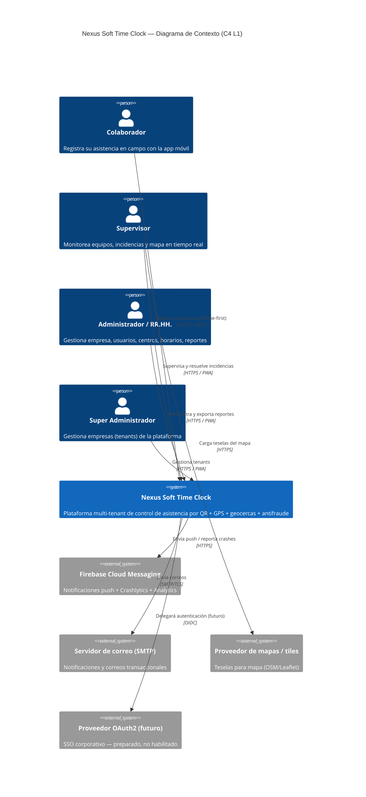

# 02 — C4 Nivel 1: Diagrama de Contexto

Muestra Nexus Soft Time Clock como caja negra, sus usuarios y los sistemas externos con los que interactúa.

## Contexto narrativo

- **Colaborador**: usa la app Flutter, mayoritariamente en campo y a veces **sin conexión**; su interacción crítica es registrar asistencia validada.
- **Supervisor / Administrador / RR.HH. / Super Admin**: usan el portal Angular (PWA) para gestión, monitoreo y reportería.
- **Sistemas externos**: FCM (push/crashlytics/analytics), SMTP (correo), proveedor de teselas de mapa, y un proveedor **OAuth2/OIDC preparado** para SSO futuro (fuera de alcance inicial, RF/RNF preparados).

El sistema es la **única fuente de verdad** de la asistencia: valida con su propia hora y reglas antifraude, sin confiar en el dispositivo.
