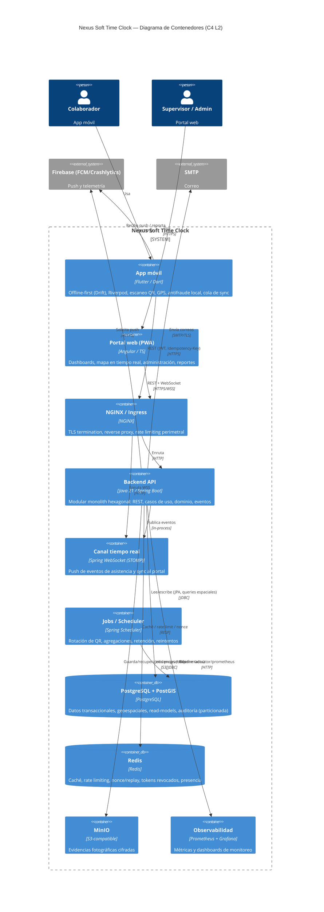

# 03 — C4 Nivel 2: Diagrama de Contenedores

Descompone el sistema en unidades desplegables (contenedores) y su comunicación.

## Notas de despliegue

- **Backend stateless**: la sesión vive en JWT + Redis; permite **escalado horizontal** detrás de NGINX/Ingress (RNF-02).
- **Scheduler**: en despliegue multi-réplica se coordina con locks (Redis/ShedLock) para no duplicar jobs.
- **PostgreSQL**: tablas de asistencia y auditoría **particionadas** por fecha/tenant (RNF-03); índices **GIST** para geoespacial.
- **MinIO** y **Redis** externalizan estado y binarios fuera del proceso de la app (12-factor).
- Todo el tráfico entra por **NGINX con TLS** (RNF-05); rate limiting perimetral + a nivel de aplicación.

Detalle de los **componentes internos del Backend API** en [04 — C4 Componentes](04-c4-componentes.md).
