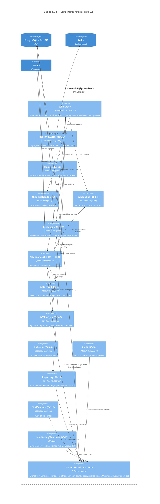

# 04 — C4 Nivel 3: Componentes del Backend API

Descompone el contenedor **Backend API** en sus módulos (bounded contexts) y la plataforma compartida. Cada módulo es hexagonal (adapters → application → domain).

## Reglas de interacción entre módulos

1. **Sincrónica (puertos):** cuando Attendance necesita validar (Geofencing, Scheduling, Anti-Fraud), invoca **interfaces (puertos)** publicadas por esos módulos. No accede a sus tablas.
2. **Asincrónica (eventos):** los efectos secundarios (auditoría, notificaciones, read-models, tiempo real) se disparan por **eventos de dominio** vía el bus + **Outbox** transaccional. Esto los hace **desacoplables** a microservicios (RNF-20).
3. **Sin acceso cruzado a datos:** ningún módulo lee las tablas de otro; cada uno posee su esquema/tablas.
4. **Shared Kernel mínimo:** solo tipos verdaderamente comunes (identificadores, value objects geográficos, contexto de tenant, contratos de eventos). Se evita convertirlo en un "cajón de sastre".

## Web Layer — convenciones API (adelanto de Iteración 4/5)

- Versionado por ruta: `/api/v1/...`
- Manejo uniforme de errores (RFC 7807 `application/problem+json`).
- Paginación/orden/filtros estandarizados (`?page=&size=&sort=&filter=`).
- DTOs de entrada validados (Spring Validation) y mappers **MapStruct**.
- Documentación **OpenAPI/Swagger UI** autogenerada.
