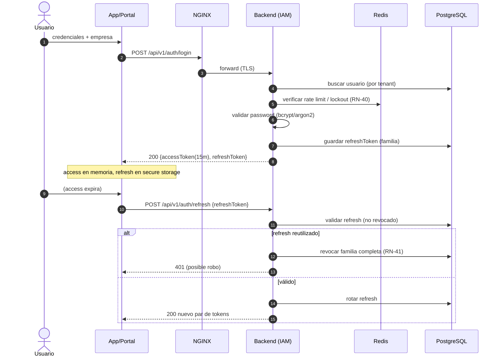
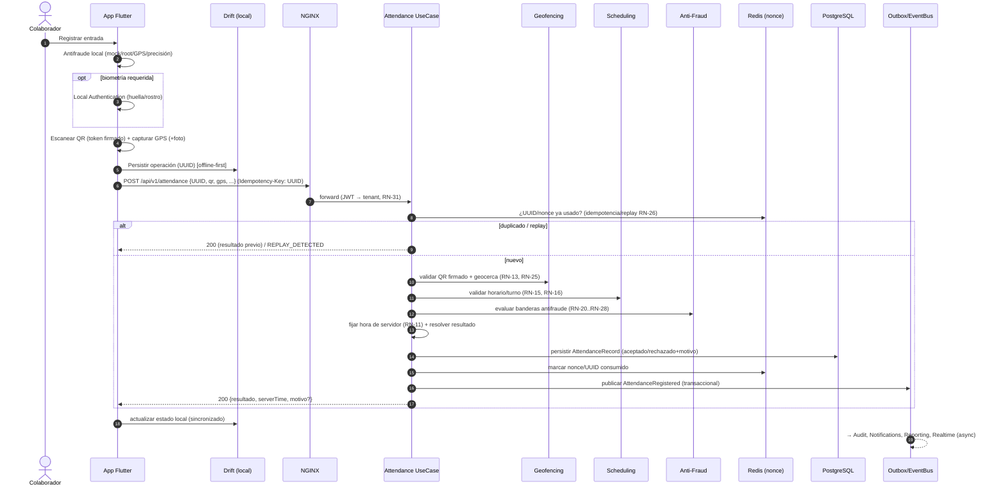
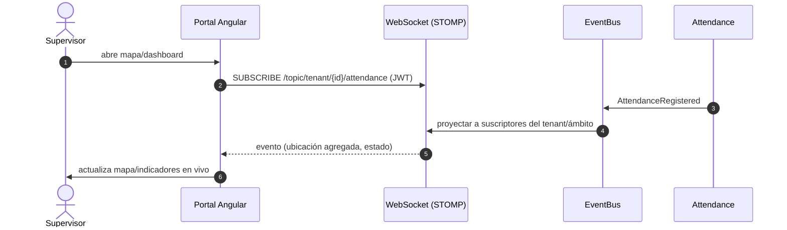

# 06 — Diagramas de secuencia (flujos críticos)

## 6.1 Autenticación (login + refresh rotatorio)



## 6.2 Registro de asistencia (entrada) — flujo núcleo (CU-02)



## 6.3 Sincronización offline (lote) — CU-05

```mermaid
sequenceDiagram
    autonumber
    participant M as App (cola sync)
    participant GW as NGINX
    participant SY as Offline Sync
    participant AT as Attendance
    participant DB as PostgreSQL

    Note over M: Recupera conectividad
    M->>GW: POST /api/v1/sync/attendance [batch de operaciones con UUID]
    GW->>SY: forward
    loop por cada operación (FIFO)
        SY->>AT: procesar (idempotente, hora de servidor)
        AT->>DB: validar + persistir (RN-53)
        AT-->>SY: resultado {ACEPTADO|RECHAZADO|INCIDENCIA}
    end
    SY-->>M: 200 [resultados por UUID] (confirmación RN-54)
    M->>M: actualizar estados; reintentar fallidos con backoff (RN-52)
```

## 6.4 Monitoreo en tiempo real (CU-11)


