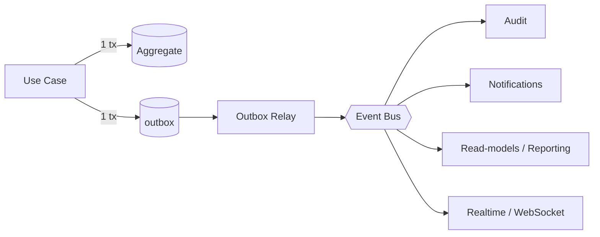
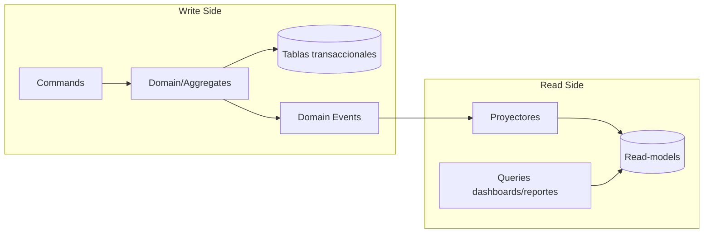

# 07 — Modelo de eventos y CQRS

## 7.1 Integración interna por eventos (Event-Driven)

Los módulos publican **eventos de dominio** cuando ocurre un hecho de negocio relevante. Los consumidores reaccionan de forma **asíncrona y desacoplada**. Esto habilita auditoría, notificaciones, read-models y tiempo real **sin acoplar** al módulo emisor.

### Transactional Outbox

Para garantizar consistencia entre el cambio de estado y la publicación del evento (evitar "dual write"):

1. El use case persiste el agregado **y** un registro en la tabla `outbox` en la **misma transacción**.
2. Un **relay** (poller/Scheduler) lee el outbox y publica al bus (in-process ahora; Kafka/RabbitMQ al migrar a microservicios).
3. Entrega **at-least-once**; los consumidores son **idempotentes**.

## 7.2 Catálogo inicial de eventos de dominio

| Evento | Emite | Consumen |
|---|---|---|
| `UserLoggedIn` / `UserLockedOut` | Identity | Audit, Notifications |
| `CompanyCreated` / `CompanyConfigured` | Tenancy | Audit, Reporting |
| `WorkSiteCreated/Updated` | Organization | Audit, Reporting |
| `GeofenceUpdated` / `SiteQrRotated` | Geofencing | Audit, Notifications |
| `ShiftAssigned` | Scheduling | Audit, Reporting |
| **`AttendanceRegistered`** | Attendance | Audit, Notifications, Reporting, Realtime, Incidents |
| `AttendanceRejected` | Attendance | Audit, Notifications, Incidents |
| `FraudFlagRaised` | Anti-Fraud | Audit, Notifications, Incidents |
| `IncidentResolved` | Incidents | Audit, Notifications, Reporting |
| `SyncBatchProcessed` | Offline Sync | Realtime (estado de sync), Audit |

## 7.3 CQRS: separación lectura/escritura

- **Escritura (command):** agregados + JPA transaccional en el módulo dueño.
- **Lectura (query):** **read-models** desnormalizados en el módulo Reporting, actualizados por los eventos anteriores. Sirven dashboards, mapa y exportaciones sin penalizar el modelo transaccional (RNF-01, RNF-03).

## 7.4 Preparación para microservicios (RNF-20)

- Bus **in-process** hoy → sustituible por **Kafka/RabbitMQ** cambiando el adaptador de mensajería, sin tocar dominio.
- Cada módulo ya posee su esquema y no comparte tablas → extraíble a su propio deployable.
- Los contratos de eventos viven en `shared-kernel` como **API estable** entre contextos.
