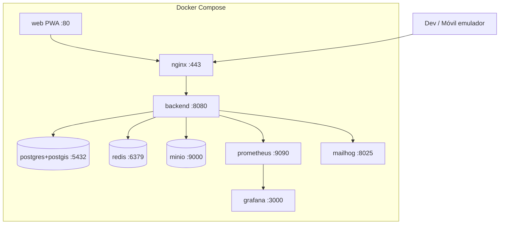
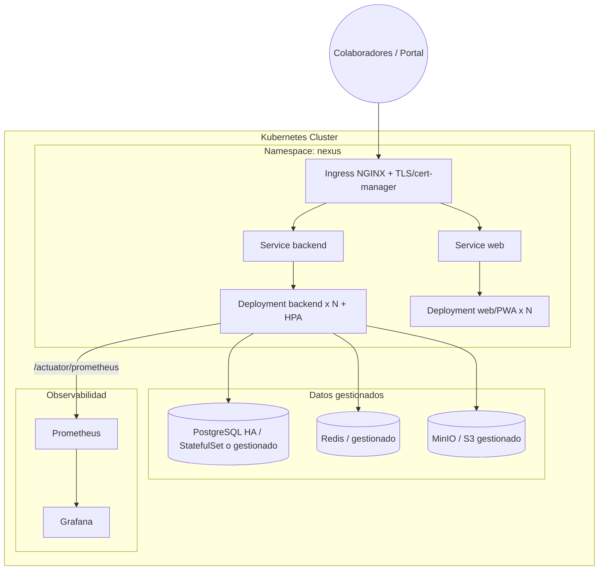

# 08 — Despliegue (Docker / Kubernetes)

## 8.1 Topología local (Docker Compose)

Para desarrollo y demos. Un solo comando levanta todo el stack.

Servicios: `nginx`, `backend`, `web`, `postgres`, `redis`, `minio`, `prometheus`, `grafana`, `mailhog` (SMTP de prueba). Variables por `.env`. Volúmenes persistentes para BD/MinIO.

## 8.2 Topología productiva (Kubernetes-ready)

### Decisiones de despliegue

| Aspecto | Enfoque |
|---|---|
| Escalado backend | **HPA** por CPU/memoria y métricas custom (req/s). Backend **stateless** (RNF-02). |
| Estado | PostgreSQL, Redis y MinIO como servicios **stateful/gestionados** fuera del Deployment de la app. |
| Config/secrets | ConfigMaps + Secrets (o Vault). Nada de credenciales en imagen. |
| Salud | Probes `liveness`/`readiness`/`startup` vía Spring Actuator. |
| Jobs | Scheduler con **ShedLock** (lock en Redis/DB) para no duplicar en multi-réplica. |
| Migraciones | Flyway como **initContainer**/job de arranque controlado. |
| TLS | Ingress NGINX + cert-manager (Let's Encrypt) — HTTPS obligatorio (RNF-05). |
| Observabilidad | Prometheus scrapea Actuator; Grafana con dashboards; alertas básicas. |
| Zero-downtime | RollingUpdate; migraciones **compatibles hacia atrás** (expand/contract). |

## 8.3 CI/CD (adelanto, se implementa en Iteración 4/13)

- **GitHub Actions**: build + test (cobertura ≥80%) + análisis estático + build de imágenes + push a registry + despliegue.
- Imágenes multi-stage (JRE slim para backend; nginx para web).
- Escaneo de vulnerabilidades de imagen y dependencias.

> Los manifiestos concretos (Dockerfiles, `docker-compose.yml`, charts/manifests de K8s, pipelines) se generan en la **Iteración 4** (configuración de repositorio/infra) y se afinan en la **13**.
