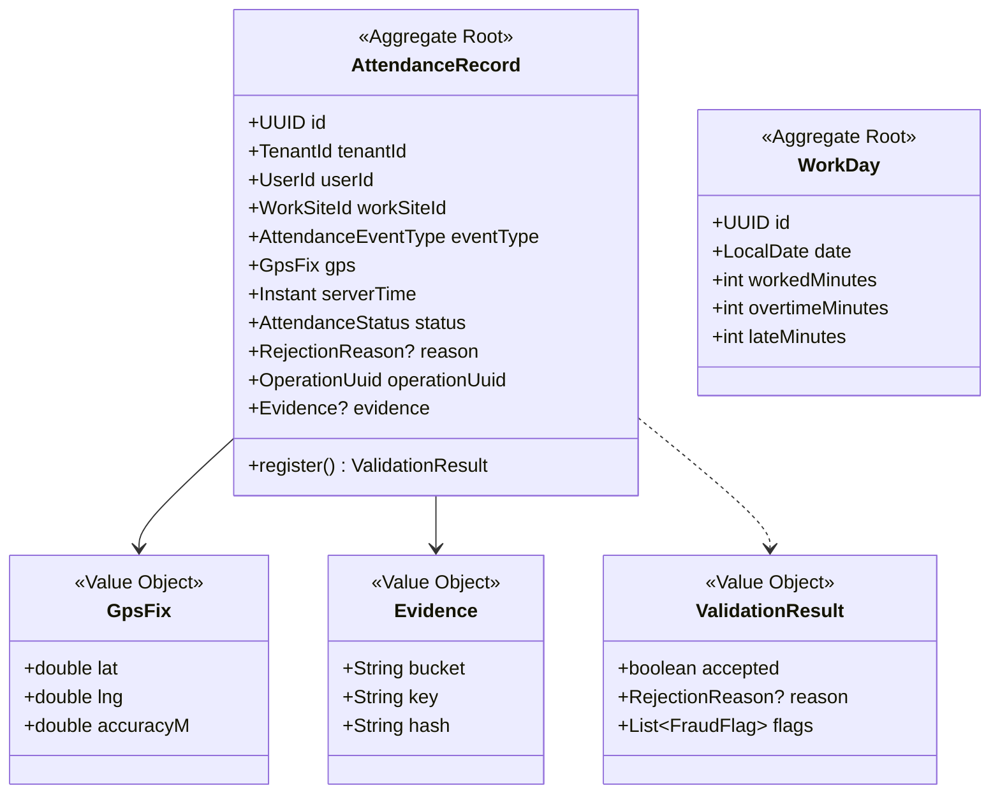
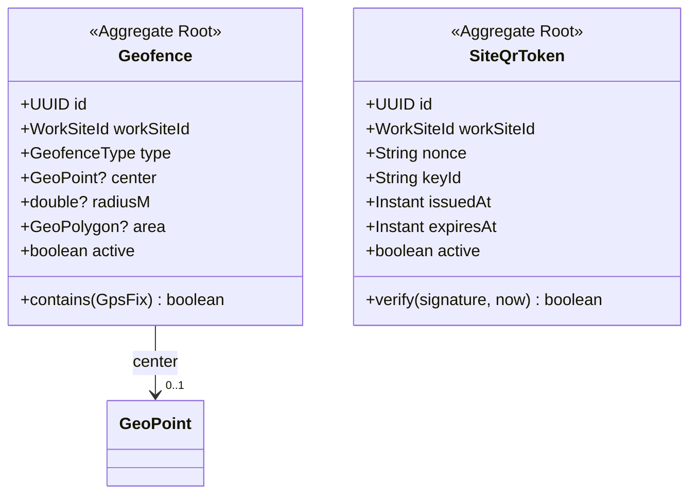
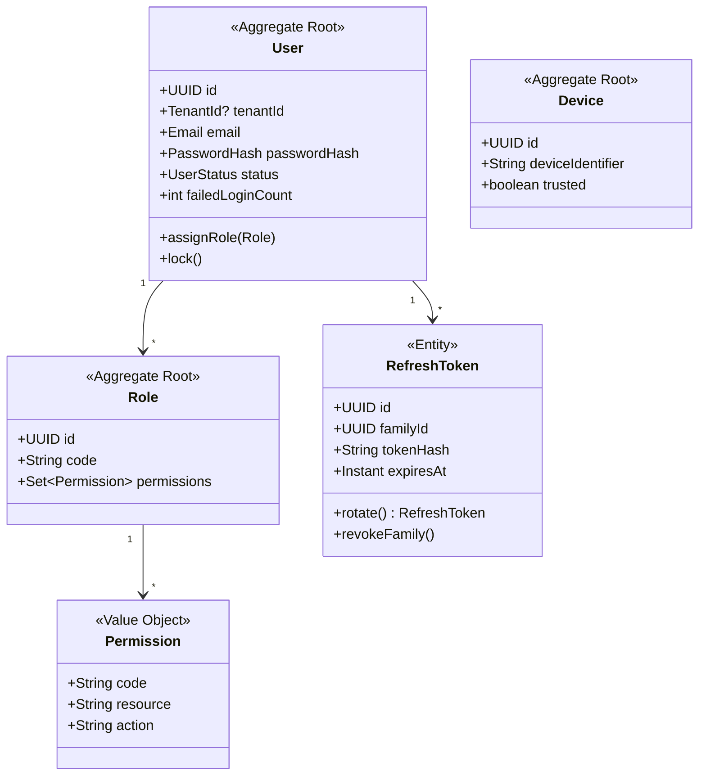

# 01 — Modelo de dominio

Modelo por bounded context (DDD). Cada **agregado** tiene una raíz que garantiza sus **invariantes**; las referencias entre agregados son por **identidad (id)**, no por objeto, para mantener límites transaccionales pequeños.

## 1.1 Attendance (BC-06) — núcleo

**Invariantes clave:**
- `serverTime` lo fija el dominio con `ServerClockPort` (RN-11); nunca el cliente.
- Un `AttendanceRecord` aceptado exige `ValidationResult.accepted == true` (RN-10).
- La secuencia de eventos por jornada debe ser válida (RN-12); se valida contra la `WorkDay` abierta.
- `operationUuid` es único por tenant → idempotencia (RN-51).

## 1.2 Geofencing (BC-05)

**Invariantes:** una geocerca CIRCLE requiere `center`+`radiusM`; POLYGON requiere `area` (CHECK `ck_geofence_shape`). Solo una geocerca **activa** por centro. Un `SiteQrToken` es válido si firma correcta + no expirado + nonce no consumido (RN-25, RN-26).

## 1.3 Identity & Access (BC-01)

**Invariantes:** `tenantId` nulo solo para SUPER_ADMIN de plataforma (RN-32, CHECK `ck_users_tenant_scope`). La reutilización de un `RefreshToken` revoca su `familyId` (RN-41).

## 1.4 Resto de contextos (resumen)

| BC | Agregado raíz | Invariantes destacadas |
|---|---|---|
| Tenancy (BC-02) | `Company` | `code`/`emailDomain` únicos; settings por defecto |
| Organization (BC-03) | `WorkSite`, `Project` | `WorkSite` tiene `location` obligatoria; `code` único por tenant |
| Scheduling (BC-04) | `Schedule` (con `Shift`) | tolerancias ≥ 0; ventana de registro coherente |
| Anti-Fraud (BC-07) | `FraudPolicy` | política por tenant/centro; produce `FraudFlag` (VO) |
| Offline Sync (BC-08) | `SyncOperation` | procesamiento idempotente por `operationUuid` |
| Incidents (BC-09) | `Incident` | transición de estado OPEN→APPROVED/REJECTED/RESOLVED audita |
| Audit (BC-10) | `AuditLog` | inmutable (append-only, RN-61) |
| Notifications (BC-12) | `Notification` | canal válido; ciclo PENDING→SENT/FAILED/READ |

> Estas clases guían las entidades JPA (adaptador de persistencia) y los mappers MapStruct de la Iteración 4+. El **dominio no depende de JPA**: las entidades de persistencia son un detalle de infraestructura (ADR-001).
