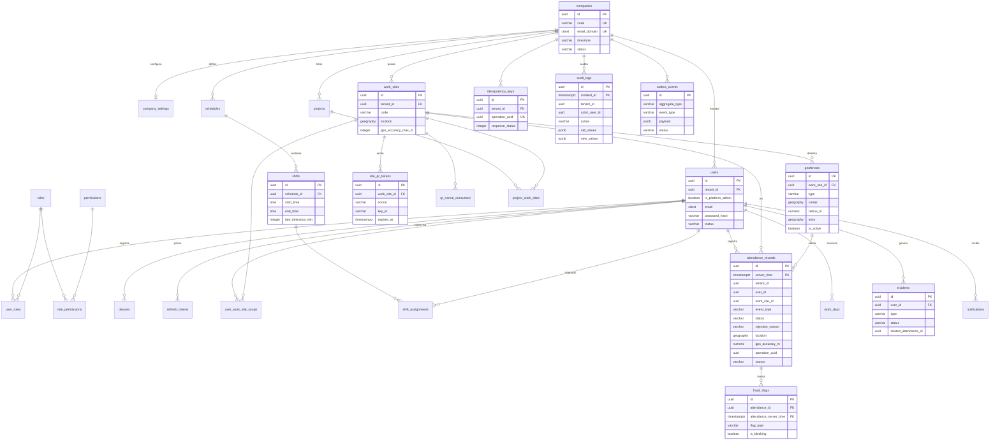

# 02 — DER (Diagrama Entidad-Relación)

Modelo relacional normalizado. `tenant_id` presente en todas las tablas de negocio (omitido en el diagrama por brevedad salvo donde es FK relevante).

> Nota: `attendance_records` y `audit_logs` tienen **PK compuesta** con la clave de partición (`server_time` / `created_at`). Las FKs hacia `attendance_records` (p.ej. `fraud_flags`) son **compuestas** por esta razón.
