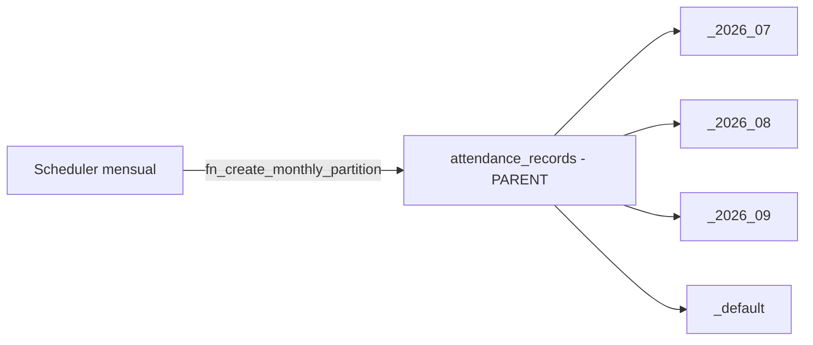

# 04 — Índices y particionamiento

## 4.1 Estrategia de índices

| Tipo | Uso | Ejemplos |
|---|---|---|
| **B-tree compuesto con `tenant_id` prefijo** | Aislamiento + filtros frecuentes | `ix_att_tenant_user_time (tenant_id, user_id, server_time DESC)` |
| **GIST (geoespacial)** | Consultas de proximidad/contención | `gix_work_sites_location`, `gix_geofences_center`, `gix_att_location` |
| **Único parcial** | Unicidad condicional | `uq_geofences_active_per_site (work_site_id) WHERE is_active` |
| **Parcial para colas** | Escaneo eficiente de pendientes | `ix_outbox_pending (occurred_at) WHERE status='PENDING'` |
| **GIN (jsonb)** | Búsqueda en documentos | `gix_audit_new_values (new_values)` |

Principios: todo acceso de negocio filtra por `tenant_id` (va primero en el índice). Los índices temporales usan `DESC` para las consultas "últimos N". Se evita sobre-indexar tablas de escritura intensa.

## 4.2 Particionamiento (RNF-03)

Tablas de altísimo volumen particionadas por **rango mensual**:

| Tabla | Clave de partición | Razón |
|---|---|---|
| `attendance_records` | `server_time` | Millones de registros; consultas por rango temporal; retención por antigüedad |
| `audit_logs` | `created_at` | Crecimiento continuo append-only; archivado/retención por mes |

**Beneficios:**
- **Partition pruning:** las consultas por rango de fecha solo tocan las particiones relevantes.
- **Mantenimiento barato:** `DETACH`/`DROP` de particiones antiguas para retención sin `DELETE` masivos.
- **Índices más pequeños** por partición → mejor caché.

**Operación:**
- Particiones iniciales creadas en las migraciones (jul–sep 2026) + partición **DEFAULT** para no fallar inserciones fuera de rango.
- Un **job (Spring Scheduler)** invoca `fn_create_monthly_partition('attendance_records', <mes+1>)` para provisionar con antelación.
- **Retención:** política configurable (p.ej. asistencia N años, auditoría según cumplimiento) mediante `DETACH` + archivado a almacenamiento frío.

## 4.3 Consideraciones de rendimiento

- **Escrituras (registro de asistencia):** camino crítico p95 < 400 ms (RNF-01). Validaciones geoespaciales aceleradas por GIST; idempotencia consultada primero en **Redis** (ADR-010) antes de tocar Postgres.
- **Lecturas (dashboards/reportes):** servidas desde **read-models** (`work_days`, vistas) y proyecciones CQRS, no desde el camino transaccional (ADR-005).
- **Conexiones:** pool (HikariCP) dimensionado; consultas parametrizadas (anti SQL-injection, RNF-07).
- **VACUUM/autovacuum:** ajustado en tablas particionadas de alta rotación.
- **Índices espaciales:** `ST_DWithin` sobre `geography` usa el índice GIST para descartar candidatos antes del cálculo exacto de distancia.
